# 3D Perception Tour with Open3D

A hands-on, seven-stage walk through the classic 3D point-cloud and LiDAR
processing pipeline, built with [Open3D](https://www.open3d.org/), `laspy`, and
`trimesh`. Each stage is a small, self-contained, runnable script that
demonstrates one core technique, prints quantitative results, and renders a
figure — so the whole canonical perception flow is visible end to end:

> **filter → estimate normals → segment ground → cluster objects → register → reconstruct surface → validate mesh → ingest LiDAR**

[](https://github.com/hurjun/open3d/actions/workflows/ci.yml)


---

## Why this exists

These primitives — voxel filtering, PCA normal estimation, RANSAC plane fitting,
DBSCAN clustering, ICP registration, Poisson surface reconstruction, mesh
quality validation, and `.las` LiDAR I/O — are the building blocks that sit
underneath SLAM, mapping, and 3D object detection in robotics. I built this to
work through each one in code rather than just reading about it: every script is
small enough to read in one sitting, the comments explain the *math and the
trade-offs* (not just the API calls), and each stage ends with a short
"takeaways" block.

The stages are intentionally independent so any one can be run, read, or
modified on its own.

---

## Pipeline at a glance

| Stage | Script | Technique | Core idea |
|------:|--------|-----------|-----------|
| 1 | `day1_pointcloud_basics.py` | Voxel downsampling + normal estimation | Grid-average to reduce density; PCA on local neighbours for normals |
| 2 | `day2_outlier_removal.py` | Statistical vs. radius outlier removal | Remove noise by global distance statistics or local density |
| 3 | `day3_ransac_dbscan.py` | RANSAC ground segmentation + DBSCAN | Robustly fit/remove the dominant plane, then cluster the rest |
| 4 | `day4_icp.py` | ICP registration | Recover the rigid transform aligning two scans (point-to-point vs. point-to-plane) |
| 5 | `day5_mesh_reconstruction.py` | Poisson surface reconstruction | Turn an oriented cloud into a watertight mesh; trim low-density artefacts |
| 6 | `day6_trimesh_basics.py` | Mesh quality validation | Check watertightness, winding, holes, connected components |
| 7 | `day7_laspy_basics.py` | LiDAR `.las` ingestion | Read LAS (xyz + intensity + classification) and convert to Open3D |

Stages 1, 2, 4, 5, 6 operate on the **Stanford Bunny** (Open3D's built-in
benchmark mesh). Stages 3 and 7 use a **synthetic, seeded driving scene**
(ground plane + boxes) generated in code, so they run with no external download.

---

## Stage details

### Day 1 — Point cloud basics
Convert the Bunny mesh to 100k points, **voxel-downsample** (partition space into
cubes of edge `voxel_size` and replace each cube's points by their centroid),
then **estimate normals** by fitting a local plane to each point's neighbours via
PCA and resolving the sign ambiguity toward a virtual camera.
Key params: `voxel_size=0.005`, normal search `radius=0.01`, `max_nn=30`.

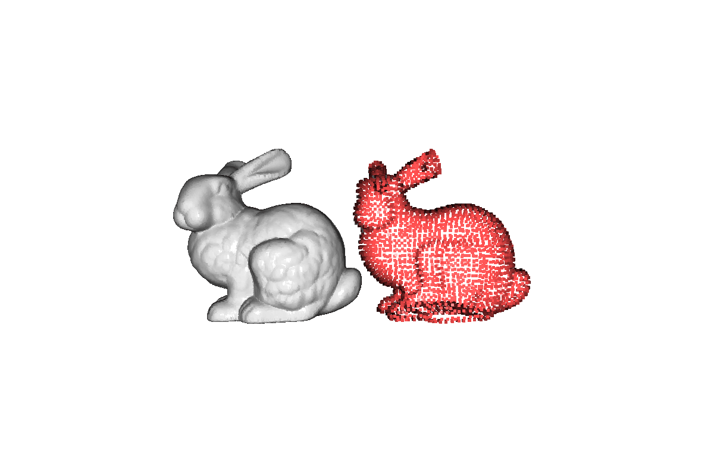

*Original (grey, 100k pts) vs. downsampled (red, ~3.1k pts) side by side.*

### Day 2 — Outlier removal
Add 500 uniformly-random noise points, then compare two denoisers.
**Statistical** removal drops points whose mean neighbour distance exceeds
`global_mean + std_ratio·σ`; **radius** removal drops points with fewer than
`nb_points` neighbours inside `radius`. The statistical method keys off the
global distribution; the radius method keys off local density and tends to be
stricter on the uneven density of real LiDAR.

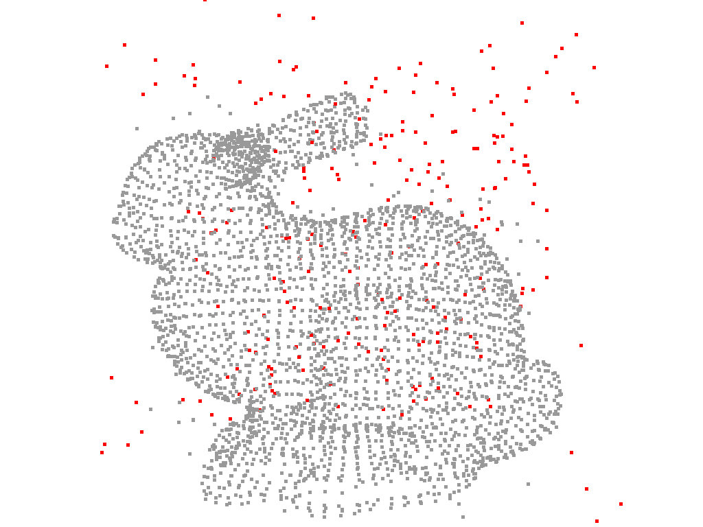

*Statistical outlier removal on the noisy Bunny: grey = kept inliers, red =
removed outliers (mostly the injected off-surface noise points).*

### Day 3 — RANSAC ground segmentation + DBSCAN clustering
The first two steps of LiDAR object detection. **RANSAC** repeatedly samples 3
points, fits a candidate plane, and counts inliers within `distance_threshold`;
the best plane over `num_iterations` is the ground (its normal comes out ≈ +z).
Removing the ground leaves the objects, which **DBSCAN** groups by density —
without needing to know the object count in advance (label `-1` = noise).

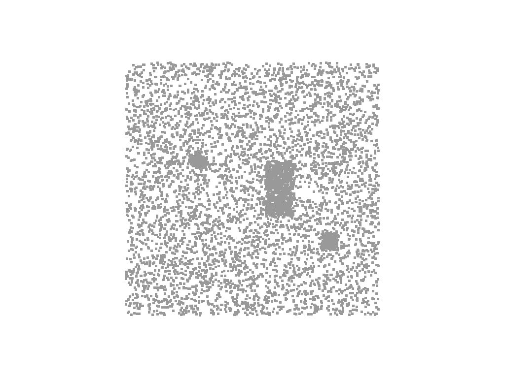

*Raw synthetic scene before segmentation (top-down): a dense ground plane with
three box-shaped objects resting on it — the input both stages below operate on.*

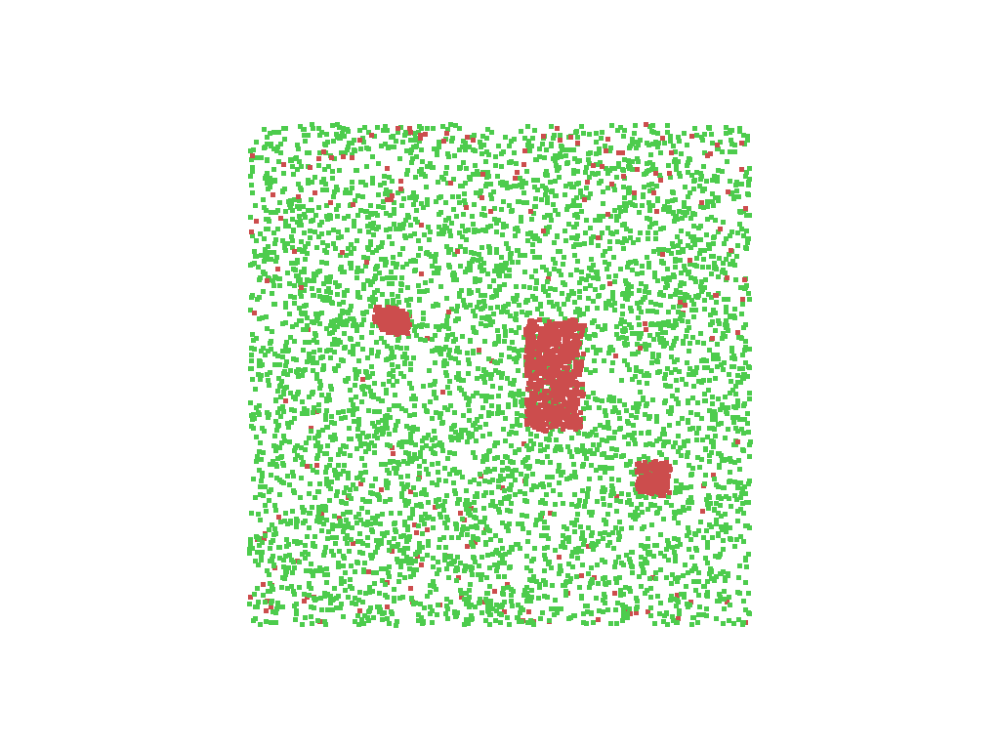 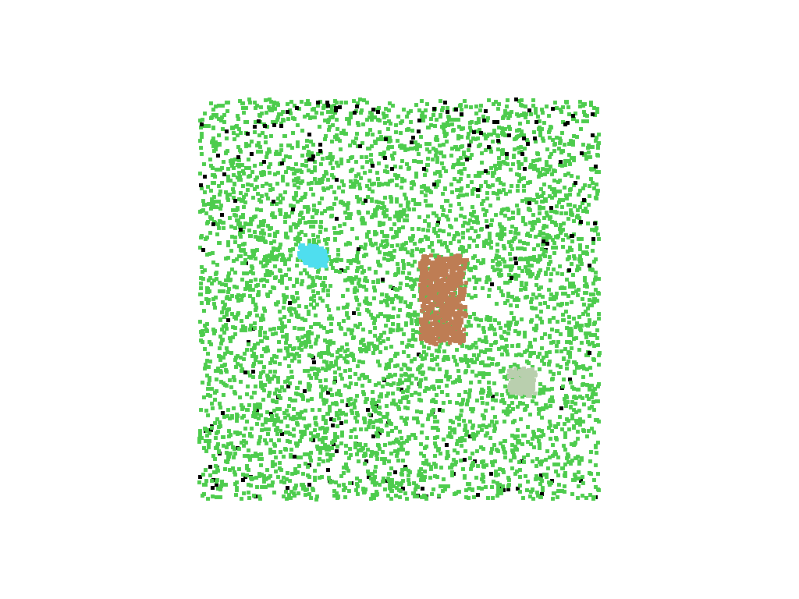

*Left: green = ground inliers, red = non-ground. Right: DBSCAN colours each
object cluster (black = noise).*

### Day 4 — ICP registration
Build a `source` cloud by translating + rotating the `target` by 15°, then
recover the alignment with **ICP**. **Point-to-point** minimises distance between
matched point pairs; **point-to-plane** minimises distance to the target surface
(using normals) and usually converges faster. Reported metrics: `fitness`
(matched-point ratio, 1.0 = best) and `inlier_rmse` (mean matched-pair error).

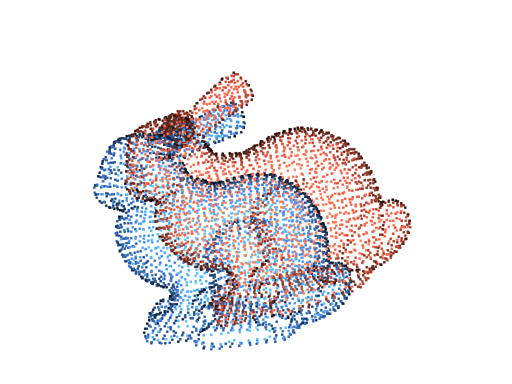 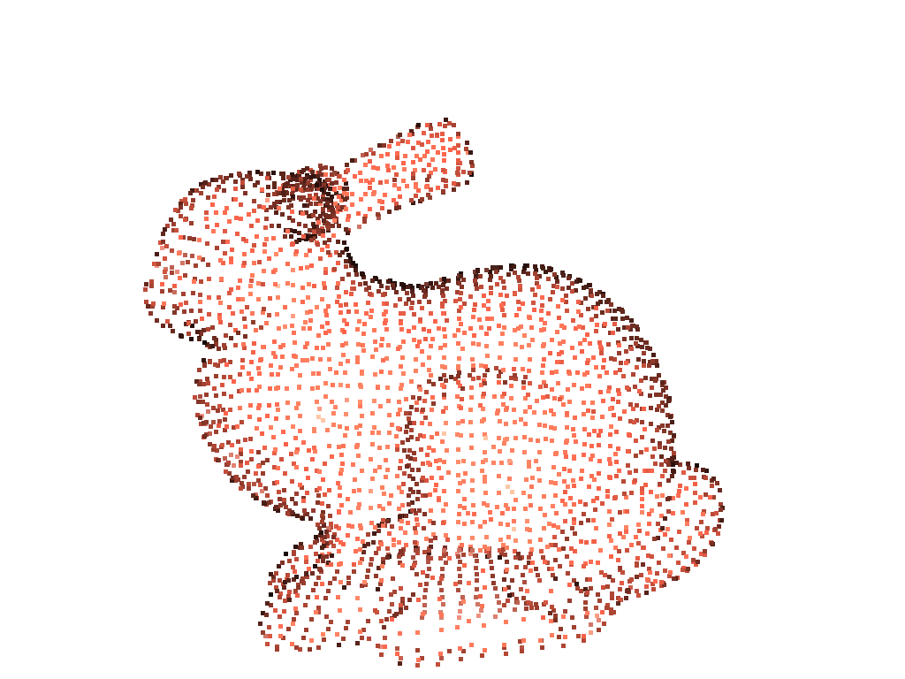

*Left: before ICP — red source is offset/rotated from blue target. Right: after
point-to-plane ICP the source lands back on the target.*

### Day 5 — Poisson surface reconstruction
**Poisson reconstruction** solves for an indicator function whose gradient
matches the cloud's oriented normals, yielding a watertight mesh. Because it can
hallucinate surface far from the real samples, the per-vertex `density` output is
used to **trim the lowest-density 5%** of vertices.
Key param: octree `depth=9` (higher = finer, slower).

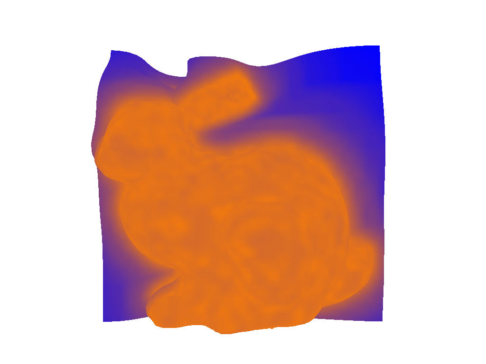 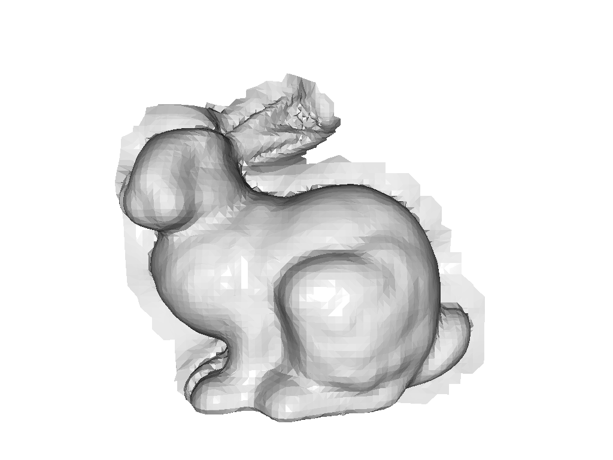

*Left: raw Poisson mesh coloured by vertex density (blue = low/spurious, yellow =
high). Right: final mesh after trimming low-density vertices.*

### Day 6 — Mesh quality validation
Convert the Bunny to `trimesh` and run the checks a mesh must pass before use in
collision / ray-casting / simulation: **watertight** (no holes), **winding
consistent** (face normals agree), **boundary edges** (edges used by a single
face = rims of holes), and **connected components** (body vs. fragments). The
Bunny is famously *not* watertight — its base is an open hole — which this stage
reports honestly.

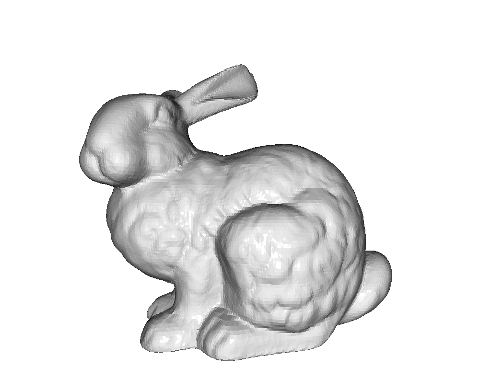

### Day 7 — LiDAR `.las` ingestion
Write a synthetic LAS 1.4 scene (ground / building / vegetation plus a vehicle
block) with ASPRS `classification` codes and `intensity`, read it back with
`laspy`, inspect the header and per-class distribution, and convert it into a
colour-coded Open3D cloud. ASPRS has no dedicated vehicle code, so the vehicle
points carry code `0` — *unclassified*, which is what the script prints; it
stands in for a vehicle in this synthetic scene. Intensity (laser return
strength) tracks material — metal vehicles reflect more strongly than vegetation.

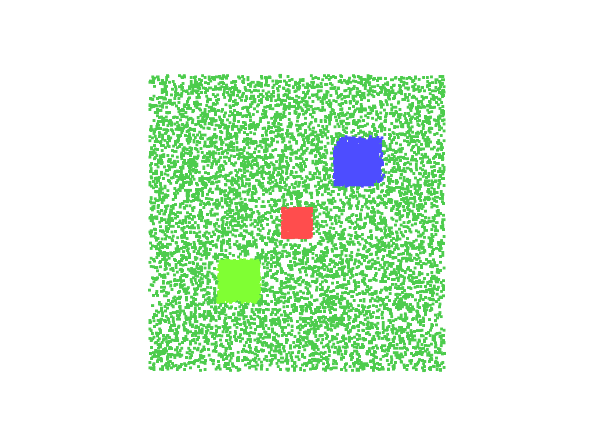 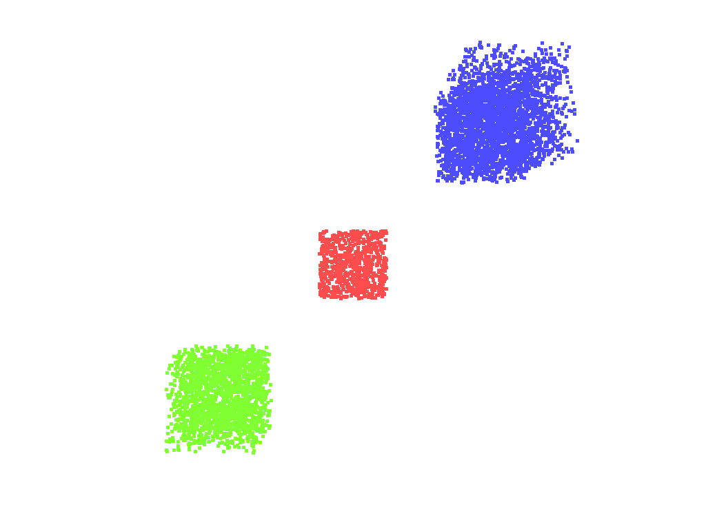

*Left: full scene coloured by classification. Right: ground class removed.*

---

## Results

Representative numbers from a single run (`python dayN_*.py`). Stages that sample
points from the Bunny surface use Open3D's sampler, which is **not** seeded, so
their point counts vary by a few percent between runs. Both synthetic-scene
stages start from a seeded point cloud, but only **Day 7** is fully reproducible:
Day 3's RANSAC plane fit (`segment_plane`) and DBSCAN are themselves unseeded, so
its ground/object split and noise count also vary a few percent run-to-run (e.g.
ground ranges ~4,930–4,990). The DBSCAN cluster count (3) and approximate sizes
(~774 / 290 / 187) stay stable; only the split and noise count drift.

| Stage | Metric | Value |
|-------|--------|-------|
| Day 1 | Voxel downsample (`voxel_size=0.005`) | 100,000 → ~3,130 pts (~96.9% reduction) |
| Day 2 | Statistical removal (`nb=20, std=2.0`) | 248 / 3,549 pts removed (~7.0%) |
| Day 2 | Radius removal (`nb=16, r=0.02`) | 233 / 3,549 pts removed (~6.6%) |
| Day 3 | RANSAC ground plane normal | ≈ (0.00, 0.00, 1.00) |
| Day 3 | Ground vs. object split | 4,990 ground / 1,310 object pts |
| Day 3 | DBSCAN (`eps=0.3, min_points=10`) | 3 clusters (774 / 291 / 187 pts), 58 noise |
| Day 4 | Point-to-point ICP | fitness 1.0000, rmse 0.000000 |
| Day 4 | Point-to-plane ICP | fitness 1.0000, rmse 0.000000 |
| Day 5 | Poisson mesh (`depth=9`) | 15,474 verts → 14,759 after 5% density trim |
| Day 6 | Bunny mesh QA | watertight **False**, winding **True**, 223 boundary edges, 1 component |
| Day 7 | Synthetic LAS scene | 13,800 pts; ground 58.0% / building 21.7% / vegetation 14.5% / unclassified (vehicle stand-in) 5.8% |

> **Note on Day 4:** the source cloud here is an *exact* rigid transform of the
> target (no added noise or partial overlap), so ICP recovers the alignment
> perfectly (fitness = 1.0). On real, noisy, partially-overlapping scans you would
> expect fitness < 1 and point-to-plane to outperform point-to-point — the harder
> regime this controlled setup is the warm-up for.

---

## Installation

Requires Python 3.10 (Open3D 0.19 wheels target 3.8–3.12). Using a project-local
virtual environment:

```bash
python3.10 -m venv .venv
source .venv/bin/activate            # Windows: .venv\Scripts\activate
pip install -r requirements.txt      # runtime deps (pinned)
pip install -r requirements-dev.txt  # pytest + ruff, for tests/lint
```

The first Bunny-based run downloads the Stanford Bunny (~3 MB) into
`~/open3d_data` and caches it.

## Running the stages

Each script opens interactive Open3D viewer windows (drag = rotate, right-drag =
pan, scroll = zoom, `Q` = close the window and advance):

```bash
python day1_pointcloud_basics.py
python day3_ransac_dbscan.py
# ... through day7_laspy_basics.py
```

**Headless mode** (no display required) renders the same scenes off-screen to PNG
files instead — this is how every figure above was produced. Each stage accepts
`--headless` and `--out-dir`:

```bash
# regenerate one stage's figures
python day3_ransac_dbscan.py --headless --out-dir figures

# regenerate every stage's figures
for d in day*.py; do python "$d" --headless --out-dir figures; done
```

## Tests & CI

A headless `pytest` suite generates a tiny synthetic scene in-process (no display,
no external data) and asserts algorithmic invariants — voxel downsampling reduces
the point count, the RANSAC plane is horizontal and dominant, DBSCAN recovers
clusters after ground removal, and the Open3D↔trimesh round trip preserves counts.

```bash
pytest -q          # run the smoke tests
ruff check .       # lint
```

GitHub Actions runs `ruff` and `pytest` on every push (see
`.github/workflows/ci.yml`).

## Repository layout

```
o3d_utils.py                 # shared helpers (loaders, conversions, headless render)
day1_pointcloud_basics.py    # voxel downsample + normals
day2_outlier_removal.py      # statistical vs. radius denoising
day3_ransac_dbscan.py        # ground segmentation + clustering
day4_icp.py                  # registration
day5_mesh_reconstruction.py  # Poisson meshing
day6_trimesh_basics.py       # mesh quality validation
day7_laspy_basics.py         # LiDAR .las ingestion
tests/test_smoke.py          # headless invariant tests
figures/                     # rendered result screenshots (committed)
requirements*.txt            # pinned runtime / dev dependencies
```

## Relevance to robotics perception

The same primitives reappear throughout robotics: voxel filtering and outlier
removal precede almost every point-cloud pipeline; RANSAC plane removal +
clustering is a standard ground-detection / proposal step; ICP is the backbone of
scan registration and LiDAR odometry; surface reconstruction and mesh validation
feed mapping, simulation, and digital-twin authoring; and `.las` I/O is how real
aerial/automotive LiDAR enters any of it. Working each one through in isolation
was the point.

**Possible extensions:** swap the synthetic scenes for a real public LiDAR tile,
add noise/partial overlap to make ICP non-trivial, and benchmark timings per
stage.

## References

- Open3D documentation & tutorials — https://www.open3d.org/docs/release/tutorial/
- Fischler & Bolles, *RANSAC* (1981)
- Ester et al., *DBSCAN* (1996)
- Besl & McKay, *A Method for Registration of 3-D Shapes* (ICP, 1992)
- Kazhdan, Bolitho & Hoppe, *Poisson Surface Reconstruction* (2006)
- ASPRS LAS specification — classification codes & point formats
